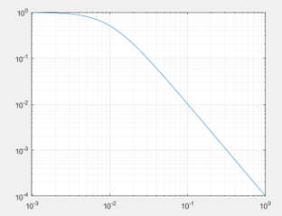
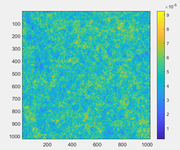

# Voici un caneva pour le tout début du projet

A/ GENERER UN OBJET DE SYNTHESE CORRESPONDANT A UN CHAMP GAUSSIEN

Pour commencer le projet, utiliser un objet conforme à l'a priori ie une réalisation d'un champ gaussien avec DSP donnée par le modèle utilisé : le modèle est défini en coordonnées polaires sous la forme.

dspo = k/((rho/rho0)^p+1);

La pente de décroissance des fréquences spatiales est fixée par p>0. p n'est pas nécessairement un nombre entier. Plus p est petit, plus la décorrélation spatiale sera rapide.
Il faut choisir p de façon à obtenir une image avec des structures de taille réaliste. Quand p augmente, la convergence de l'algorithme de déconvolution est plus lente.

commencer avec p = 2;
rho = toutes les coordonnées des fréquences spatiales en polaire
Pour les obtenir, générer toutes les fréquences normalisées avec freqspace pour par exemple np=2048 points, puis tous les points échantillonnés en fréquence avec meshgrid, puis tous les points en coordonnées polaires avec cart2pol

prendre k=1 et rho0=0.01
dspo = k/((rho/rho0)^p+1);
tracer le profil de la dsp et comprendre le rôle de rho0

générer le champ pseudo-aléatoire :
générer la dsp pseudo-aléatoire
tfo = randn(np) * sqrt(dspo);
récupérer l'objet en prenant la partie réelle de la TF inverse 2D du champ tfo (attention aux fftshift)

prendre le quart de l'objet (un des quatre quadrants), et soustraire la moyenne pour avoir un champ dont les valeurs partent de 0.

B/ UTILISER CET OBJET POUR TESTER L'ALGORITHME

On commence par générer l'image de l'objet après passage par le système d'imagerie, en utilisant pour commencer la psf
psf = alpha*psf_1 + (1-alpha)*psf_3, avec par exemple alpha=0.2

Puis on tracera la valeur du critère de déconvolution en fonction de alpha pour voir si le minimum correspond au alpha choisi

==================================================================================
Le fichier fits contient 3 PSFs, qui peuvent être utilisées pour simuler des images :

- PSF_1 = défoc nulle,

- PSF_2 = défoc RMS  pi/2

- PSF_3 = defoc RMS  pi.

Commencer par n'utiliser que les 2 PSFs extrêmes, pour pouvoir *tracer* le critère en fonction d'un alpha scalaire sans utiliser d'optimiseur :

psf = alpha*psf_1 + (1-alpha)*psf_3, avec par exemple alpha=0.2.
